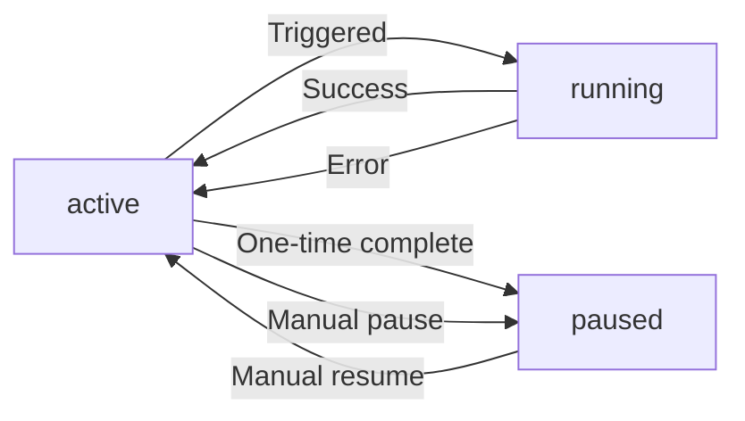

## Overview

The Lookout API enables you to create scheduled research agents that automatically run searches at specified intervals. This is a Pro-only feature that leverages QStash for reliable cron-based scheduling.

<Note>
  Lookout is a Pro-only feature. Users must have an active subscription to create and run scheduled searches.
</Note>

## POST /api/lookout

Create or trigger a lookout (scheduled research agent).

### Request Body

<ParamField body="lookoutId" type="string" required>
  Unique identifier for the lookout. Use UUIDv7 format.
</ParamField>

<ParamField body="userId" type="string" required>
  User ID of the lookout owner. Must match an existing user with Pro subscription.
</ParamField>

<ParamField body="prompt" type="string" required>
  The research prompt/query to execute. This will be sent to the AI model for processing.
</ParamField>

### Lookout Configuration Fields

When creating a new lookout, additional fields are stored in the database:

<ParamField body="title" type="string" required>
  Human-readable title for the lookout (e.g., "Daily AI News Digest")
</ParamField>

<ParamField body="frequency" type="string" required>
  Schedule frequency. Options:
  - `"once"` - Run once and pause
  - `"hourly"` - Run every hour
  - `"daily"` - Run daily
  - `"weekly"` - Run weekly
  - `"custom"` - Custom cron schedule
</ParamField>

<ParamField body="cronSchedule" type="string">
  Cron expression for scheduling (required for recurring lookouts).
  
  Format: `CRON_TZ={timezone} {cron_expression}`
  
  Example: `CRON_TZ=America/New_York 0 9 * * *` (9 AM daily in New York)
</ParamField>

<ParamField body="timezone" type="string" required>
  IANA timezone identifier (e.g., `"America/New_York"`, `"Europe/London"`)
</ParamField>

<ParamField body="status" type="string">
  Lookout status: `"active"`, `"paused"`, or `"running"`. Defaults to `"active"`.
</ParamField>

### Example Request

```bash
curl -X POST https://scira.ai/api/lookout \
  -H "Content-Type: application/json" \
  -H "Cookie: better-auth.session_token=<your-session-token>" \
  -d '{
    "lookoutId": "01933d5e-8f2a-7890-b1c2-d3e4f5a6b7c8",
    "userId": "user_01933d5e-8f2a-7890-b1c2-d3e4f5a6b7c9",
    "prompt": "Summarize the latest developments in AI safety research, focusing on alignment and interpretability. Include key papers, breakthroughs, and ongoing debates."
  }'
```

### Response Format

The endpoint returns a Server-Sent Events (SSE) stream similar to the Search API:

```json
{
  "type": "data-appendText",
  "data": "## Key Points\n\n- Recent advances in mechanistic interpretability..."
}
```

### Cron Schedule Format

Lookouts use standard cron expressions with timezone support:

```
┌───────────── minute (0 - 59)
│ ┌───────────── hour (0 - 23)
│ │ ┌───────────── day of month (1 - 31)
│ │ │ ┌───────────── month (1 - 12)
│ │ │ │ ┌───────────── day of week (0 - 6) (Sunday to Saturday)
│ │ │ │ │
│ │ │ │ │
* * * * *
```

**Examples:**

| Expression | Description |
|------------|-------------|
| `0 9 * * *` | Every day at 9:00 AM |
| `0 */6 * * *` | Every 6 hours |
| `0 9 * * 1` | Every Monday at 9:00 AM |
| `0 0 1 * *` | First day of every month at midnight |
| `0 9 * * 1-5` | Every weekday at 9:00 AM |

**With Timezone:**

```
CRON_TZ=America/New_York 0 9 * * *
```

## Execution Details

### Model and Configuration

Lookouts use the following configuration:

- **Model**: `scira-grok-4-fast-think` (xAI Grok-4 with reasoning)
- **Tools**: `extreme_search` only (focused deep research)
- **Stop Condition**: Maximum 2 tool execution steps
- **Max Retries**: 10 (for reliability)

### Research Quality

Lookouts are optimized for comprehensive research reports:

- **Format**: 3-page research paper format with markdown
- **Citations**: Mandatory inline citations for all factual claims
- **Structure**: Key points, detailed sections, analysis, and conclusion
- **Depth**: Detailed paragraphs (4-6 sentences minimum) with technical depth

### Email Notifications

Upon completion, lookouts send an email notification to the user containing:

- Chat title (auto-generated)
- Response summary (first 2000 characters)
- Link to full chat/results

### Metrics Tracking

Each lookout run tracks:

- **Duration**: Total execution time in milliseconds
- **Tokens Used**: Total tokens consumed (input + output)
- **Searches Performed**: Count of extreme_search tool calls
- **Run Status**: `"success"` or `"error"`
- **Error Message**: If applicable

## Status Management

### Status Flow

1. **active** - Scheduled and ready to run
2. **running** - Currently executing
3. **active** - Returns to active after completion
4. **paused** - One-time lookouts after execution, or manually paused

### Status Transitions



## Next Run Calculation

For recurring lookouts, the next run time is automatically calculated:

```typescript
const options = {
  currentDate: new Date(),
  tz: lookout.timezone
};

const cleanCronSchedule = lookout.cronSchedule.startsWith('CRON_TZ=')
  ? lookout.cronSchedule.split(' ').slice(1).join(' ')
  : lookout.cronSchedule;

const interval = CronExpressionParser.parse(cleanCronSchedule, options);
const nextRunAt = interval.next().toDate();
```

## QStash Integration

Lookouts leverage [QStash](https://upstash.com/docs/qstash) for reliable scheduling:

- **Reliability**: Automatic retries on failure
- **Timezone Support**: Runs in user's specified timezone
- **Scalability**: Handles thousands of concurrent schedules
- **Monitoring**: Built-in metrics and logging

## Usage Tracking

Lookout runs consume resources from your Pro subscription:

- Each run increments **extreme search usage counter**
- Token usage is tracked per run
- All runs are logged with metrics

## Response Structure

Successful lookout executions create:

1. **New Chat**: Each run creates a new chat with title "Scheduled: {title}"
2. **Messages**: User message (prompt) and assistant response
3. **Metadata**: Includes model, tokens, completion time

### Database Records

```typescript
{
  lastRunAt: Date,
  lastRunChatId: string,
  runStatus: "success" | "error",
  duration: number,        // milliseconds
  tokensUsed: number,      // total tokens
  searchesPerformed: number, // tool call count
  error?: string,          // if failed
  nextRunAt: Date          // for recurring
}
```

## Error Handling

### Common Errors

<ResponseField name="404 Not Found">
  Lookout not found
  ```json
  {
    "error": "Lookout not found"
  }
  ```
</ResponseField>

<ResponseField name="404 Not Found">
  User not found
  ```json
  {
    "error": "User not found"
  }
  ```
</ResponseField>

<ResponseField name="403 Forbidden">
  Pro subscription required
  ```json
  {
    "error": "Lookouts require a Pro subscription"
  }
  ```
</ResponseField>

<ResponseField name="500 Internal Server Error">
  Execution failed
  ```json
  {
    "error": "Internal server error"
  }
  ```
</ResponseField>

### Error Recovery

When a lookout run fails:

1. Status is set back to `"active"`
2. Error message is logged to database
3. Next scheduled run proceeds normally
4. No email notification is sent

### Retry Logic

Lookouts include retry logic:

- **Lookout validation**: 3 retries with exponential backoff
- **AI generation**: 10 max retries via AI SDK
- **QStash**: Built-in delivery retries

## Best Practices

<AccordionGroup>
  <Accordion title="Use specific, focused prompts">
    Lookouts work best with well-defined research questions. Be specific about what information you want and in what format.
    
    **Good**: "Summarize daily AI safety papers from arXiv, focusing on alignment research with citations"
    
    **Poor**: "Tell me about AI"
  </Accordion>
  
  <Accordion title="Set appropriate frequencies">
    Consider the rate of change in your topic:
    - Fast-moving topics: hourly or daily
    - Academic research: daily or weekly
    - Industry trends: weekly or monthly
  </Accordion>
  
  <Accordion title="Monitor your usage">
    Even as a Pro user, monitor your lookout usage:
    - Check run metrics (duration, tokens, searches)
    - Review generated content quality
    - Adjust prompts and frequency as needed
  </Accordion>
  
  <Accordion title="Use appropriate timezones">
    Set lookouts to run in your local timezone for better scheduling:
    - Morning briefings: 8-9 AM local time
    - End-of-day summaries: 5-6 PM local time
    - Weekly reports: Monday mornings
  </Accordion>
  
  <Accordion title="Handle one-time vs recurring">
    Use `"once"` frequency for:
    - Testing lookout configurations
    - One-off deep research tasks
    - Event-specific research
    
    Use recurring frequencies for:
    - Ongoing monitoring
    - Regular briefings
    - Continuous learning
  </Accordion>
</AccordionGroup>

## Example Use Cases

### Daily AI News Digest

```json
{
  "title": "Daily AI News Digest",
  "prompt": "Research and summarize the most important AI developments from the past 24 hours. Focus on breakthrough research, product launches, policy changes, and industry news. Include citations.",
  "frequency": "daily",
  "cronSchedule": "CRON_TZ=America/New_York 0 8 * * *",
  "timezone": "America/New_York"
}
```

### Weekly Academic Research Summary

```json
{
  "title": "Weekly ML Papers",
  "prompt": "Find and summarize the top 10 machine learning papers published this week on arXiv. Focus on papers with novel architectures, training techniques, or significant benchmark improvements. Include paper titles, authors, and key contributions.",
  "frequency": "weekly",
  "cronSchedule": "CRON_TZ=Europe/London 0 9 * * 1",
  "timezone": "Europe/London"
}
```

### Market Intelligence

```json
{
  "title": "Competitor Monitoring",
  "prompt": "Research recent developments, product launches, and news about [Competitor Name]. Include funding news, hiring trends, product updates, and market positioning. Provide detailed analysis with sources.",
  "frequency": "weekly",
  "cronSchedule": "CRON_TZ=America/Los_Angeles 0 10 * * 1",
  "timezone": "America/Los_Angeles"
}
```

## Next Steps

<CardGroup cols={2}>
  <Card title="Search API" icon="magnifying-glass" href="/api/search">
    Learn about the underlying search API
  </Card>
  <Card title="Rate Limits" icon="gauge" href="/api/rate-limits">
    Understand Pro subscription limits
  </Card>
</CardGroup>